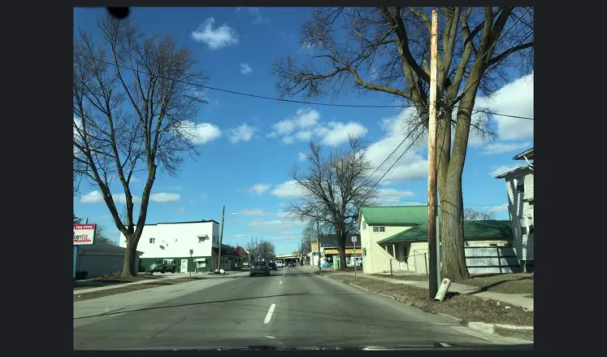
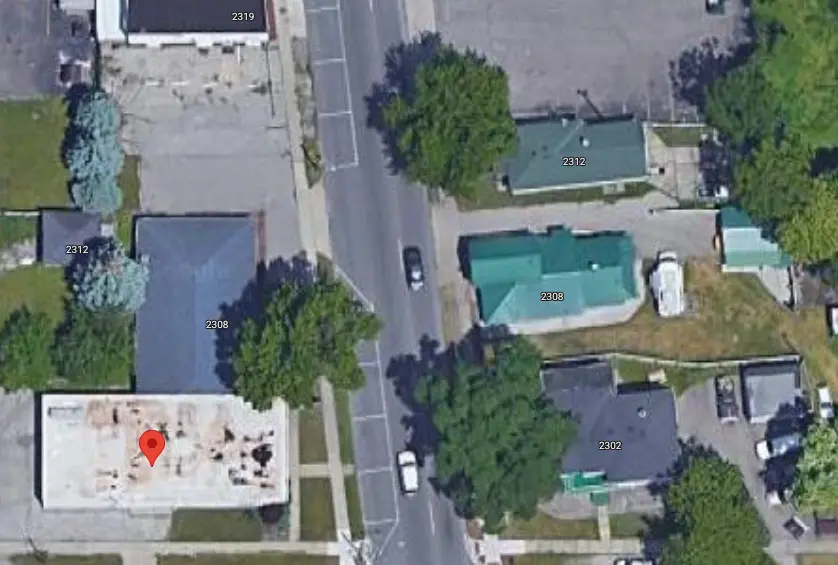
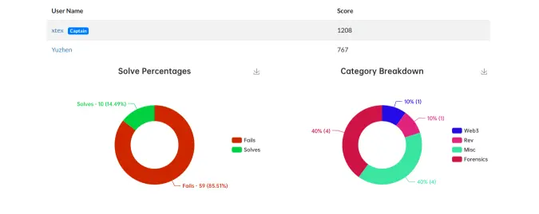

[link to CrewCTF](https://crewc.tf/)

[题解有关资源](https://cloud.exozy.me/s/L5P44FksWoY69g7)（[.sig](https://cloud.exozy.me/s/eoPKgQs8S4gJSyJ)，[Internet Archive](https://archive.org/download/xtex-crew-ctf-write-up-res)）

## Misc

### Sanity

> Join our discord : https://discord.gg/eaPVRtf3Pt

#general#announcement的描述，`crew{1n54n1ty_0r_s4n1ty}`

### findme


可以看到EXIF一片空白

[OSM上搜索](https://www.openstreetmap.org/search?query=%E6%AD%A6%E7%94%B0%E7%A5%9E%E7%A4%BE#map=19/35.68669/138.57739&layers=N)“武田神社”可以直接搜索到一块区域

可以看到甲府山梨線标注了和图上一样的31

以及可以看出来是右转转入31的，以及是十字路口（可以直走）

看不懂日文但是能看到各"Kofu Sta."（甲府站）

两个地方是连着一条路的，Google Maps标出了天桥

答案是`crew{35.6682,138.5699}`，最后一位试一下即可，后来题目加上了flag的哈希可以本地校验

thanks to @ProjectXero

### in car



没有了文字，要“find the street name”

EXIF也是空的

必应搜出来是密苏里州的，左边有个什么“ignRL”，电话是755-7773

DuckDuckGo搜索电话可以找到Sign PAL in Saginaw, MI 48602 - (989) 755-7773 / 2301 N Michigan Ave Saginaw MI 48602

基本可以确定密苏里州

~~找了半天原来就是N Michigan Ave后面不用加ST~~

`crew{N Michigan Ave}`



### helpmeeeee

**没做出来**

> A woman named `Azuradonia Sylyxion` was working at a store. One day, while she was working, she was suddenly kidnapped by `a robber` who had been planning the act for a long time. Azura was abducted and taken to an unknown location.
>
> After being missing for a few days, a letter arrived at the store where Azura worked. `The letter` was written by the kidnapper and contained an address where she could  be released. The letter instructed Azura's boss to bring a ransom to the address and give it to a man who would come to pick it up.
>
> ```
> for this chall u have 2 jobs, first u need find the store, and u need find the letter, you got the letter from a robber, you can go to  the instructions he gave, and you can get the flag from a robber
> ```
>
> Author : st4rn

Azuradonia Sylyxion是真实人名，但是DDG只能搜索到[flicker](https://www.flickr.com/photos/198139388@N05/52836755100/)

图片全是一个地点，三个月前上传，图片里面有个One Stop（UK的便利店）

Yuzhen找到了85 Coleridge Rd, Moorside, Oldham OL1 4RJ UK，new8.jpg直接喂给Google Lens

~~答案是Flicker Explore~~

### Feedback Form

填表得10分

## Forensics

### Attaaaaack2

一个1G多的.raw，花了半天才下载下来

> Q1. What is the best profile for the the machine?

`file(1)`出来是`Windows Event Trace Log`，~~所以用[python-evtx](https://github.com/williballenthin/python-evtx)处理一下，`sudo zypper in libevtx-tools python311-evtx`，启动！~~

诶不对啊这不是evtx，“our IR team took a memory dump”

下载个[volatility3](https://www.volatilityfoundation.org/releases-vol3)

`vol -f memdump.raw windows.pslist.PsList`，启动！

答案出来了是47

### Attaaaaack1

~~为什么我不先做1啊啊好奇怪啊~~

所以Windows的best profile是什么呢？


不会是`vol2 --profile`那个profile罢~~还真是~~

但是不知道为什么linux上的vol2只会显示`Win7SP1x86`不会显示构建号

使用vol3看到构建号

```
NTBuildLab      7601.24214.x86fre.win7sp1_ldr_es
```

但是[vol2 wiki上](https://github.com/volatilityfoundation/volatility/wiki/2.6-Win-Profiles)没有24214，24000不对那就是23418

`crew{Win7SP1x86_23418}`

### Attaaaaack3

**没做出来**

> Q3. i think the user left note on the machine. can you find it ?

从envars可以看到有个notepad.exe

PsScan扫出来

```
2556    300     notepad.exe     0x3fd90030      2       58      1       False   2023-02-20 19:03:41.000000      N/A     Disabled
```

使用dumpfiles找到几个dump

```
DataSectionObject       0x8426f508      notepad.exe     file.0x8426f508.0x85fdc538.DataSectionObject.notepad.exe.dat
ImageSectionObject      0x8426f508      notepad.exe     file.0x8426f508.0x842624a0.ImageSectionObject.notepad.exe.img
DataSectionObject       0x8426f508      notepad.exe     file.0x8426f508.0x85fdc538.DataSectionObject.notepad.exe.dat
ImageSectionObject      0x8426f508      notepad.exe     file.0x8426f508.0x842624a0.ImageSectionObject.notepad.exe.img
DataSectionObject       0x843e64e0      notepad.exe.mui file.0x843e64e0.0x8426f008.DataSectionObject.notepad.exe.mui.dat
DataSectionObject       0x85352f80      notepad.exe.mui file.0x85352f80.0x8426f008.DataSectionObject.notepad.exe.mui.dat
DataSectionObject       0x8426f508      notepad.exe     file.0x8426f508.0x85fdc538.DataSectionObject.notepad.exe.dat
ImageSectionObject      0x8426f508      notepad.exe     file.0x8426f508.0x842624a0.ImageSectionObject.notepad.exe.img
```

DataSection把ImHex和Ghidra的分析器都炸了，把进程内存单独dump一次

```bash
vol -f memdump.raw windows.memmap.Memmap --pid 2556 --dump
strings -e l pid.2556.dmp | sort | uniq > notepad/strings.txt
```

还是找不到

### Attaaaaack4

`windows.malfind.Malfind`找到了一堆，但是只有这个rundll32.exe是只有一个RWX页的，其他进程都有好多个

```
300     runddl32.exe    0x3f0000        0x3f0fff        VadS    PAGE_EXECUTE_READWRITE  1       1       Disabled
00 00 00 00 59 e9 52 10 ....Y.R.
03 00 e8 f5 ff ff ff 00 ........
00 00 00 00 00 00 00 e8 ........
e8 ff ff ff 0a 00 3f 00 ......?.
00 00 00 00 e8 db ff ff ........
ff 17 00 3f 00 00 00 00 ...?....
00 e8 ce ff ff ff 24 00 ......$.
3f 00 00 00 00 00 e8 c1 ?.......        00 00 00 00 59 e9 52 10 03 00 e8 f5 ff ff ff 00 00 00 00 00 00 00 00 e8 e8 ff ff ff 0a 00 3f 00 00 00 00 00 e8 db ff ff ff 17 00 3f 00 00 00 00 00 e8 ce ff ff ff 24 00 3f 00 00 00 00 00 e8 c1
```

`crew{rundll32.exe_300}`

### Attaaaaack5

`windows.pstree.PsTree`可以发现

```
300     2876    runddl32.exe    0x84398998      10      2314    1       False   2023-02-20 19:03:40.000000      N/A
* 2556  300     notepad.exe     0x84390030      2       58      1       False   2023-02-20 19:03:41.000000      N/A
```

上面的300进程有且只有一个子进程，`crew{notepad.exe}`

### DUMPster

**没做出来**

没有题目描述。解压出来两个文件，`Debian_5.10.0-20-amd64_profile.zip`和`memory`

造个`profiles`文件夹把profile塞进去`vol2 --plugins=profiles --info`就能看到profile了

```
LinuxDebian_5_10_0-20-amd64_profilex64 - A Profile for Linux Debian_5.10.0-20-amd64_profile x64
```

然后就做不出来了

### Quirky

**没做出来**

一个pcap，打开看到里面只有一个TCP连接，还是HTTP

直接选择WireShark的追踪流把TCP数据导出来

```
GET /flag.jpg HTTP/1.1
Host: 192.168.122.1
Connection: keep-alive
Upgrade-Insecure-Requests: 1
User-Agent: Mozilla/5.0 (Windows NT 10.0; Win64; x64) AppleWebKit/537.36 (KHTML, like Gecko) Chrome/108.0.0.0 Safari/537.36
Accept: text/html,application/xhtml+xml,application/xml;q=0.9,image/avif,image/webp,image/apng,*/*;q=0.8,application/signed-exchange;v=b3;q=0.9
Accept-Encoding: gzip, deflate
Accept-Language: en-US,en;q=0.9

HTTP/1.1 200 OK
Server: Evil
Content-Length: 36585
```

后面是一串不太正常的JPG，在6-9字节可以看到ASCII的JFIF表明是JPEG

尝试用ImHex修复，没修好，发现损坏的图像似乎有两个DQT？

## Web

### sequence_gallery

**没做出来**

难题1：我怎么打不开这个http server（那就先用exozy.me+curl答题

然后本地造个环境测试

```bash
python3 -m venv env
. env/bin/activate
pip install flask
sudo zypper install bc
python3 main.py
```

实际上是调用`dc`进行的渲染，然后有个简单的防注入

```python
if ' ' in script_file or 'flag' in script_file:
```

但是这个似乎不能靠shell注入，只能注入dc

可以看到dc的usage里面

```
  -e, --expression=EXPR    evaluate expression
```

大概要靠这个，`http://127.0.0.1:8080/?sequence=-e=1%203%20p%23`得到3，注入成功接下来想办法读文件

## Rev

### OhPHP

自己写AST解析和静态推导然后转回PHP

可以得知：

1. Flag长度为41字符

2. 以`crew{`开始

3. `crew{`后面四个字符的CRC32（十进制）倒过来在`7607349263`中（大概率是等于

   使用`fuzz-5.php`进行一个破的爆得知5-9位是`php_`，已知：`crew{php_`

4. 9-13位XOR 5-9位会得到一个奇怪的字符串

   使用`fuzz-9.php`爆破得知9-13位是`1s_4`，已知：`crew{php_1s_4`

5. 奇奇怪怪的AES条件

   ```php
   srand('31337') . define('D', openssl_decrypt('wCX3NcMho0BZO0SxG2kHxA==', 'aes-128-cbc', substr(constant('F'), '0', '16'), '2', pack('L*', rand(), rand(), rand(), rand()))));
   in_array(array_sum(array(ctype_print(constant('D')), strpos(substr(constant('F'), '15', '17'), constant('D')))), array('2'))
   ```

   但是这个爆破不了了，定义域太大了

   整理得到

   ```php
   $d = openssl_decrypt('wCX3NcMho0BZO0SxG2kHxA==', 'aes-128-cbc', substr($pre, 0, 16), 2, constant('iv'));
   if (ctype_print($d) + strpos(substr($pre, 15, 17), $d) == 2) {
       var_dump($pre);
   }
   ```

   观察可以发现D始终为16位（块加密算法特性，TEA也是这样），以及`ctype_print($d)`只有`crew{php_1s_4_l4`才会为true，此时D=`ngu4ge_0f_m4g1c_`

   ~~经测试`crew{php_1s_4_l4ngu4ge_0f_m4g1c_`可以通过~~

   由于`strpos`的参数（`$needle`）长度=17，$len(d)=16$，$strpos\leq1$，$ctype\_print\leq1$，所以只有两个函数都返回`true`（隐式转换为1）时，条件才能成立。

6. ```php
   strcmp(base64_encode((hash('sha256', substr(constant('F'), '0', '32')) ^ substr(constant('F'), '32'))), 'BwdRVwUHBQVF')
   ```

   这一步为`base64(sha256(0-32 bytes) ^ 32-41 bytes == BwdRVwUHBQVF)`，由于前32位已知和XOR的自反特性，这里可以直接解

   ```php
   <?php echo (base64_decode('BwdRVwUHBQVF') ^ hash('sha256', 'crew{php_1s_4_l4ngu4ge_0f_m4g1c_')) ?>
   ```

`crew{php_1s_4_l4ngu4ge_0f_m4g1c_5b0e7b6a}`

### ez rev

**没做出来**

这里有点离谱的，有两个检查实现，一个会始终输出“Why are you still here”另一个才会检查

实际检查很简单，把另一个数据字符串按字节XOR 0x70即可，但是入口点实际会在另一个函数（ghidra的`_INIT1`），这个函数不会检查，同时会通过`ptrace(2)`检测调试器附加，main实际指向真实的检查函数，但是[`__libc_start_main`](https://refspecs.linuxbase.org/LSB_3.1.0/LSB-generic/LSB-generic/baselib---libc-start-main-.html)的`init`参数指向了那个INIT1，INIT1会实现用户交互，并直接exit，**中途还会修改比较的数据（所以直接dump出来的数据段是错误的flag）**，解法应该是要在中途CALL到真正的实现（但是太晚了没时间做了

## 总结

好玩的，感谢Yuzhen的参与，队伍总计1975分，第70名。

学到了一些关于法证学的知识，以及第一次手写静态推导。

比赛从CST前天下午1:00开始，下午3:00我开始参赛，今天凌晨1:00结束，共32h。

也可以参考一下DC里面[其他人的Write Up](https://discord.com/channels/959047109015904306/965183289621110794)

- [6E 61 74 68（helpmeeeee）](https://hackmd.io/@6E617468/HkO3ZddKn)
- [L-T-B（Hex2dec）](https://github.com/L-T-B/CTFS/blob/main/crew-ctf/web/hex2dec.md)
- [daffainfo](https://github.com/daffainfo/ctf-writeup/tree/main/CrewCTF%202023)
- [Siunam](https://siunam321.github.io/ctf/CrewCTF-2023/)
- [untrue.me（Safe Proxy）](https://untrue.me/writeups/crewctf2023/safe-proxy/)


