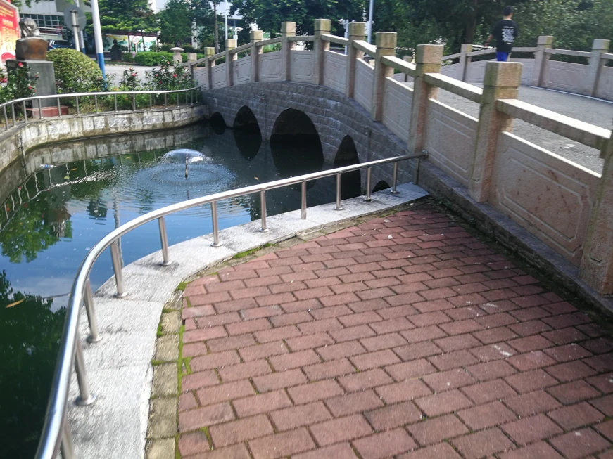

这是重写的游记，上一篇被我不小心 `git reset --hard` 没了

## Day -INF

怎么说呢，这是我第一次参加OI类的比赛

今年刚好初中毕业，八月用一些奇怪的方式联系上了高中学校的指导老师

~~和不熟悉的人聊天真的是太可怕了~~

但最终还是顺利完成了报名，但是我什么准备都没做，~~全靠CTF的经验~~

上洛谷做了下去年的题，好！看来我连初赛都过不了，去丢人了

## Day -1

晚上上晚修时老师把打印好的准考证拿过来了

## Day 0

中午吃完饭就从学校出了，去考点

太美丽啦

两个教室分别贴了两张纸，第一考场和第二考场，大家准考证写的都是第二但是老师说只有一个，全部人都去第一

然后直接把第二考场的纸撕了下来（

### R：running or runnable (on run queue)

做到T14：哦，求和，函数，我会

再看一眼：什么东西这是在求什么

不会，跳了，brain PRNG解决问题。

### T：stopped by job control signal

我考的好菜啊，还好没穿校服，高二没人认识我

从进考场到离开我就没和任何人说过一句话

## Day +1

上洛谷提交了下，答案很多都忘了，重做了一遍，45.5 pts，好了过不了了

## Day +INF

啊啊啊啊，63.5 pts！什么今年晋级线怎么这么低

摸了个一等奖，开心，甚至是市S1第一，呜呼！

甚至在考场见到了多年未见的小学同学（但是不敢上去打招呼

回去学了下分治第K小，~~发现好像不是很难（也可能是我的错觉~~
