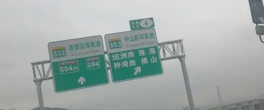
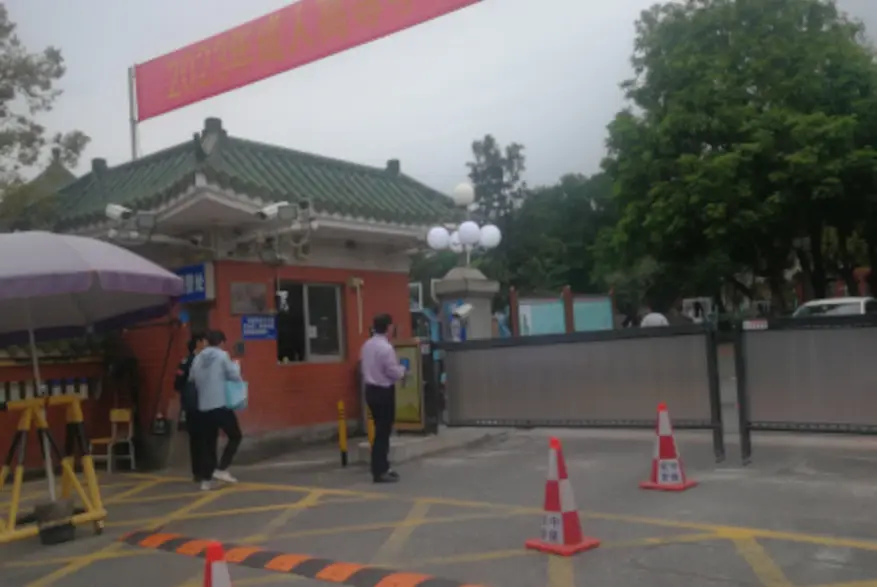
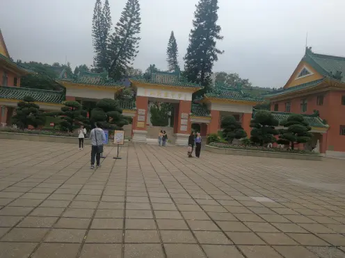
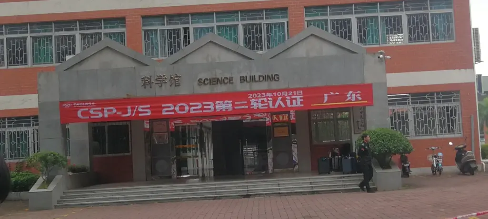

迟到的游记

## Day -INF

得知我是我市初赛S组第一名还是很高兴的，本来期待复赛拿一等但是还是没能

有几次集训，但不多

## Day 0

我们学校一共有四个人过了晋级线，但是某人因某些原因没去成

刚好周六考试前一天周五考完月考，双休，因为我家离学校有点远就没回去（高一第一次双休没了www

晚上没睡好，早上爬起来准备洗个澡发现学校早上没热水，只好冷水洗完之后吃早餐回教室，

不想去自习，一个人在（我们班的）教室里面睡了一会儿，差不多8:00出学校

和另外两人汇合后去找老师，老师开车去考点

路上一路在睡觉，到了之后吃了饭，又休息了一会就进纪中了

好高级

进去之后发现还不能进考场（合着发通知提前一小时到就是废话？），于是就在纪中到处游荡

刚好和成人高考在同一天，别人在复习，CSP选手在玩，以学校为单位游荡

T1一个半小时炫完了，还以为我做错了~~，感觉好简单~~

T2反手动规，本来有25pts的

T3大模拟，很适合我！（但是没调出来，只有25pts

最后半分钟不小心碰了下键盘的`w`然后直接`CTRL+Z`撤销，然后Dev-C++把我的一个`]`也扬了，T2直接CE了，qswl，

**我与Dev-C++不共戴天**

晚上吃完饭回家，回到家凌晨了，直接睡觉

## Day +INF

125pts，100+0+25+0

二等，唉，如果T2没有CE刚好可以一等，唉

我与Dev-C++不共戴天

以后我都要用VSCode！

虽然没有一等，但是可以A+B类报名NOIP？

[关于部分平台私自发布CSP-J/S 2023认证结果的公告](https://www.noi.cn/xw/2023-10-23/796608.shtml)，笑死

下次最后半分钟不乱改东西了
